# java-library-management-system

A library management system demo in Java. Since this was a project developed in the Heilbronn University codebase and supported by several fellow students, the repository only contains the code provided by my team. Therefore, it is not executable.

## Features

### System

- Token factory that generates a token for the user
- User verification is achieved through the token
- Duplicate logins are not possible with the token
- Login with authentication

### Libary

- Users are reminded of overdue books
- Books can be borrowed
- Books can be renewed
- Books can be reported missing
- Personal information can be changed
- Password can be changed
- Account can be deleted
- Logout is possible
- Library is searchable

### Testing

- All methods and classes were tested, accuracy was 96%.

### UI

- Errors are caught and displayed as a popup
- Confirmations are caught and displayed as a popup
- Navigation is guaranteed

## Tech Stack 🛠️

### Languages 💻

### Frameworks & UI ⚙️

### Build Tools 📦

### Developer Tools 🧰

## Excepts
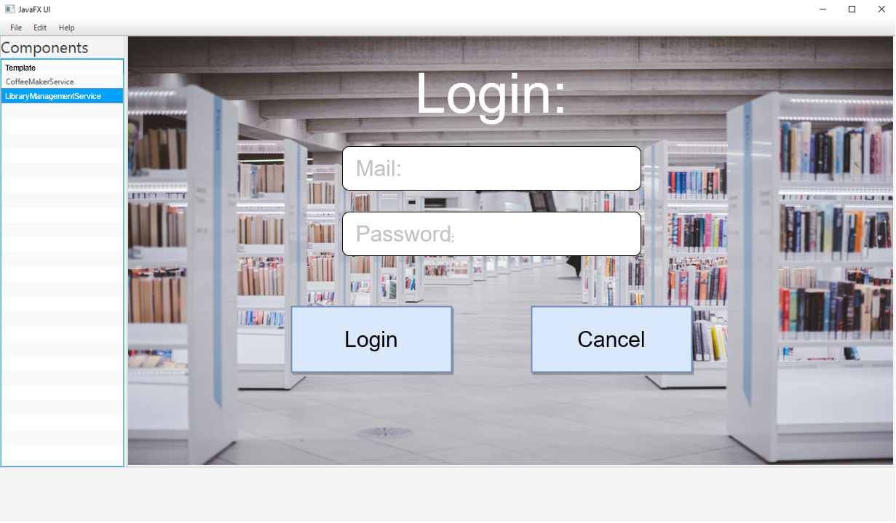
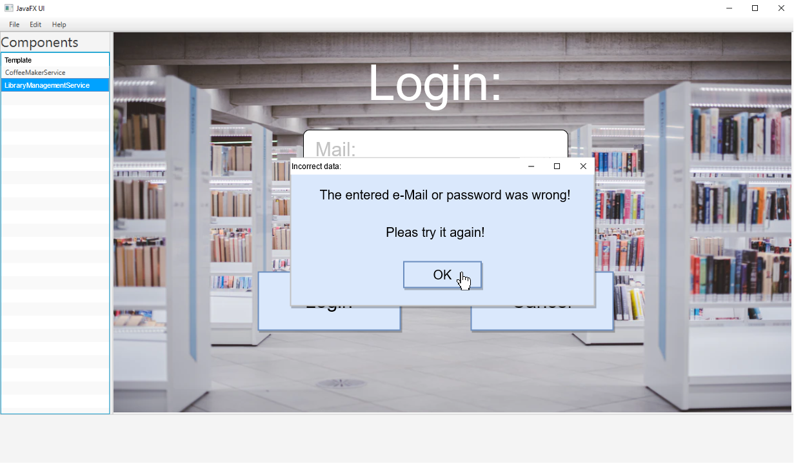
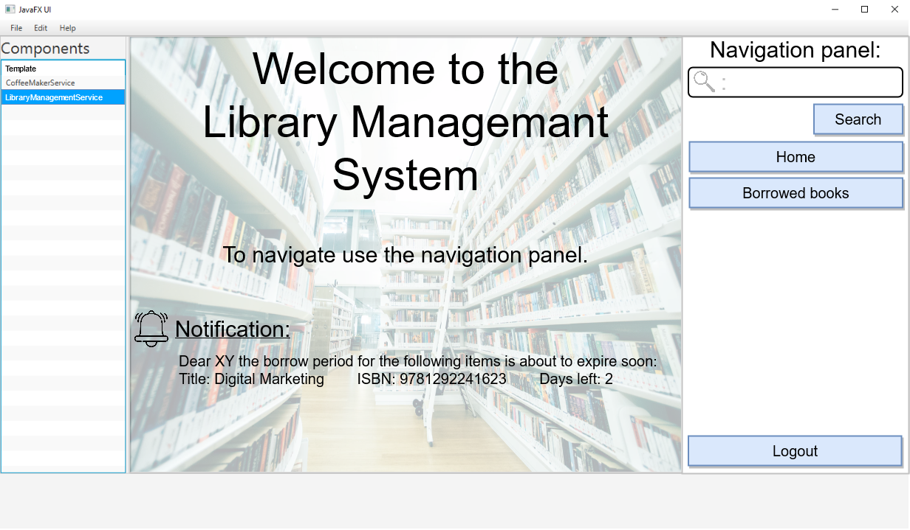
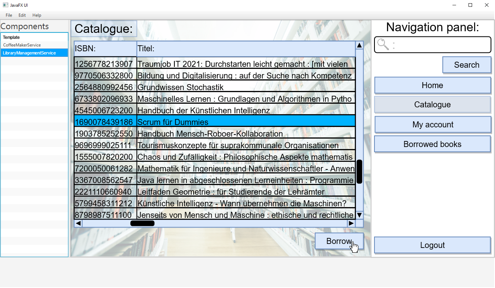
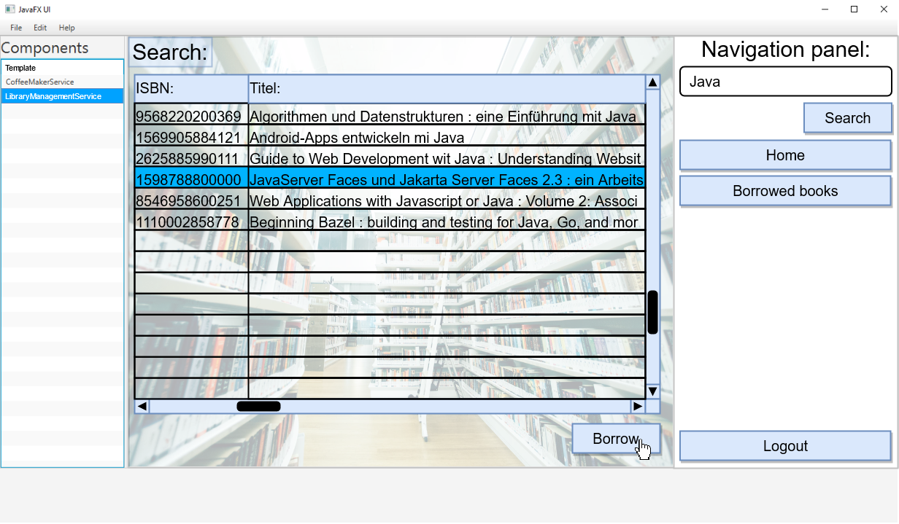
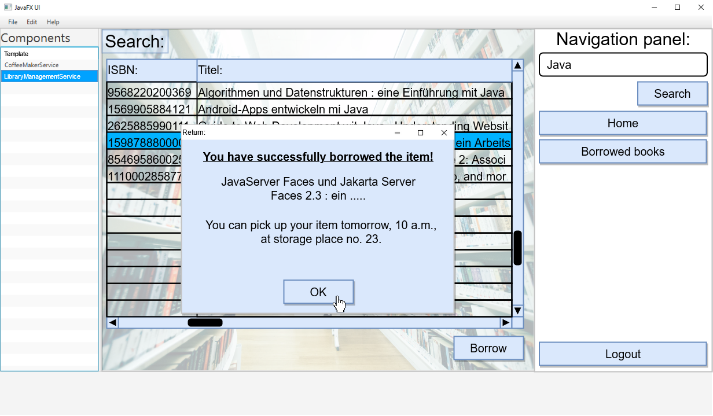
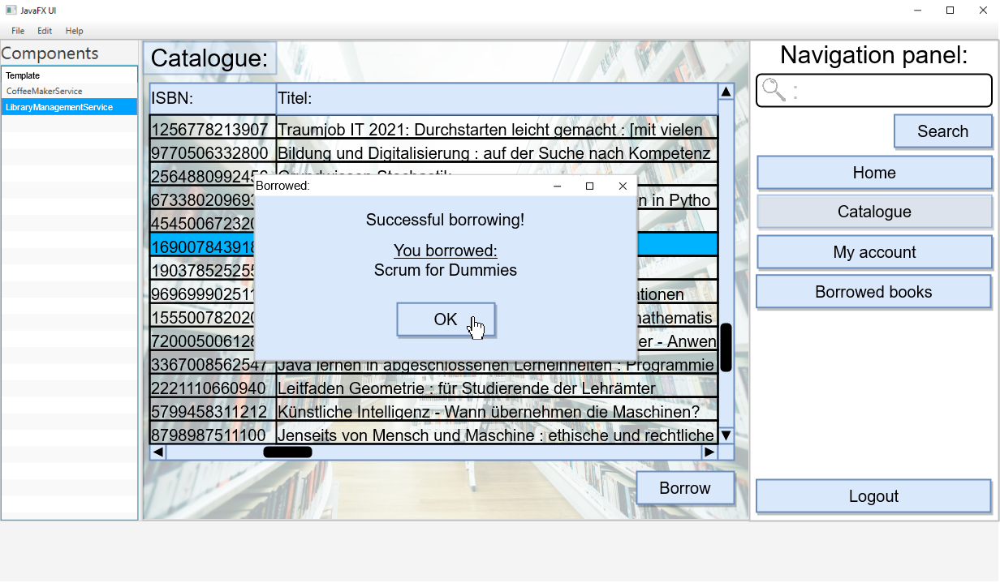
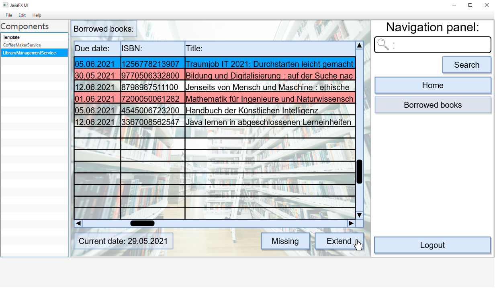
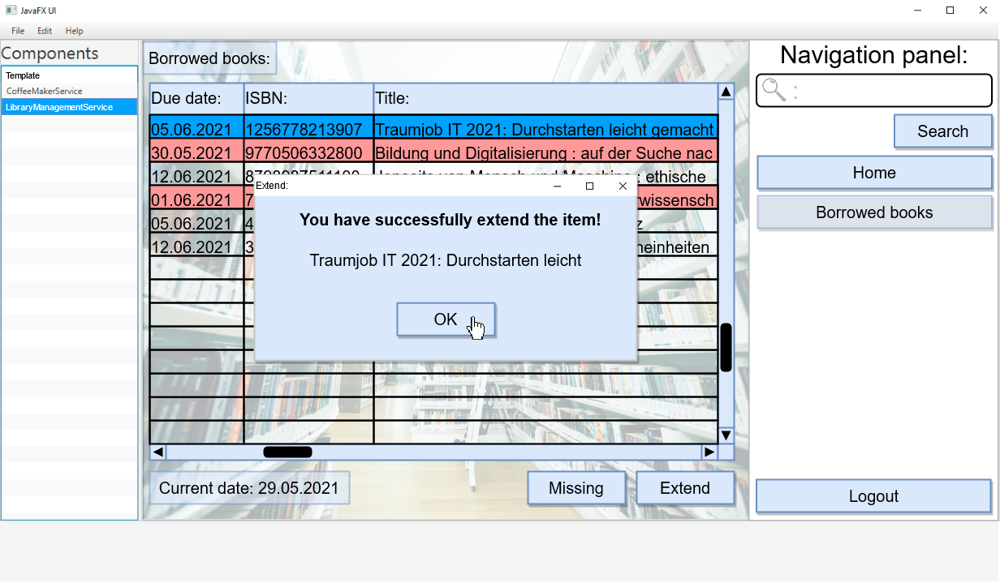
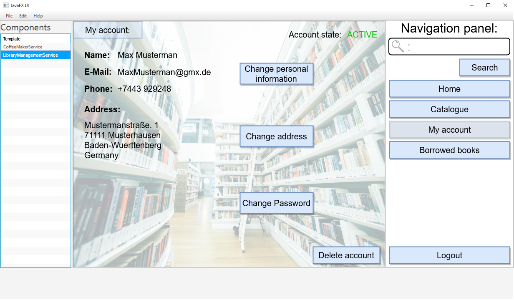
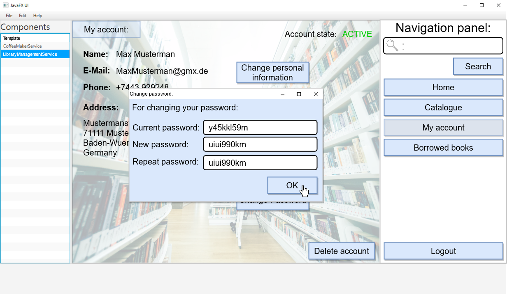
